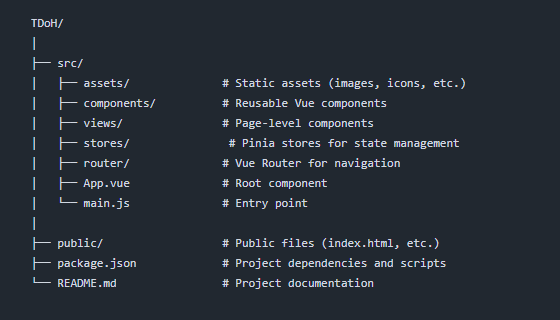

# TDoH - Frontend

TDoH (Task-Driven Organizational Helper) is an application designed for people with ADHD to help them manage tasks and subtasks in a structured, easy-to-use manner. This README provides an overview of the frontend project built using Vue 3 and Tailwind CSS.

## Table of Contents
- [Getting Started](#getting-started)
- [Project Structure](#project-structure)
- [Features](#features)
- [Dependencies](#dependencies)
- [Installation](#installation)
- [Environment Variables](#environment-variables)
- [User Flow](#user-flow)
- [Backend](#backend)
- [Known Issues](#known-issues)
- [Future Improvements](#future-improvements)
- [Screenshots](#screenshots)
- [Contact](#contact)

## Getting Started

This project is the frontend for TDoH and connects to the backend built with Spring Boot. It uses Vue 3 with Composition API and Tailwind CSS for styling.

### Prerequisites

Make sure you have the following installed on your machine:
- [Node.js](https://nodejs.org/) 
- [npm](https://www.npmjs.com/)
- [Vue CLI](https://cli.vuejs.org/)

## Project Structure

```bash
git clone https://github.com/Miharu669/TDoh-PersonalProject-F5-Front
cd TDoH

```




## Features
- Task Management: Create, update, patch, and delete tasks.
- Subtasks Support: Break down tasks into smaller subtasks (future support for mini-tasks).
- Pomodoro Timer: Integrated timer for task management.
- Points System: Earn points for completing tasks (main tasks: 250 points, subtasks: 25 points, mini-tasks: 5 points). (Not yet implemented on frontend)
- Notifications: Web notifications for the timer (currently)
- Calendar Integration: Schedule appointments/tasks or delete all tasks for a day – your tasks, your choice!

## Dependencies

- Vue 3 Composition API
- Pinia for state management
- Axios for API Calls
- Tailwind CSS for Styling
- vue-router for navigation
- vue-3-notifications for notifications
- Google-SDK (future implementation)

## Instalation
```bash
npm install
npm run dev
```

## Enviroment Variables
```bash
VITE_API_ENDPOINT=http://localhost:8080/api/v1
```

## User Flow


## BackEnd
- Back Repo: [TDoH-BackEnd](https://github.com/Miharu669/TDoh-PersonalProject-F5-Back)

### **Known Issues**
```markdown
## Known Issues

- Issue 1: Everytime you switch views the pomodoro pauses.
- Issue 2: tasks doesnt remain crossed when you click and mark it as done on the frontend.
- Issue 3: Subtasks not working as intended


Feel free to open an issue if you encounter something not listed here.
```

## Future improvements
Some planned features or improvements:
- Improve mobile responsiveness
- Fix subtask and implement minitask
- Implement the points system.
- Add social login (e.g., Google).

## Screenshots


## Contact
- Name: Verónica Doel
- Email: veronicadoelfuentes@gmail.com
- GitHub: [Miharu669](https://github.com/Miharu669)

